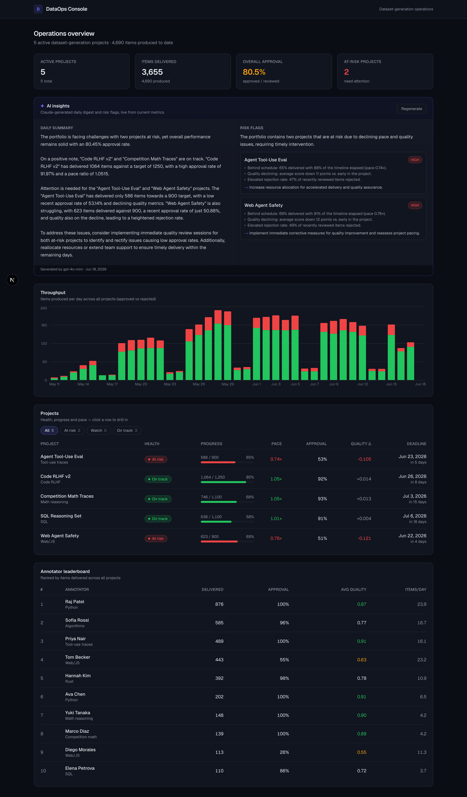
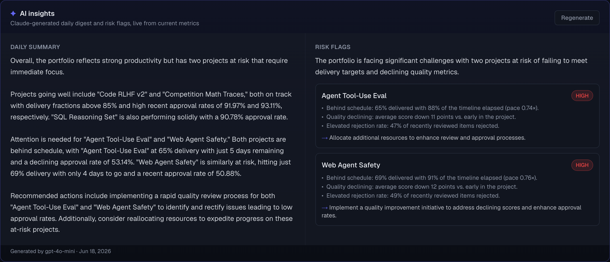
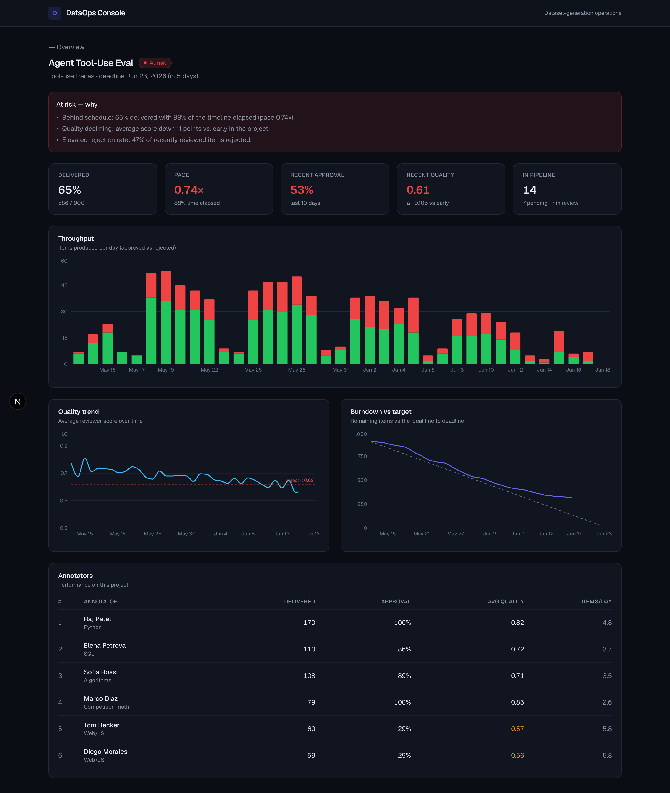

# DataOps Console

A full-stack dashboard for monitoring **dataset-generation projects** — the kind
a data vendor runs for a frontier AI lab. It tracks throughput, quality,
annotator performance and timeline burndown across several concurrent projects,
and uses an LLM to turn the live metrics into a daily status digest and to flag
projects trending at-risk.



## What it simulates

Several dataset-generation projects running in parallel, each with a contracted
item target and deadline, staffed by annotators of varying speed and quality.
The seed generates ~6 weeks of history with a deliberate mix so the charts and
risk flags have something real to show:

- **Healthy projects** — steady throughput, stable/rising quality, on pace.
- **At-risk projects** — throughput decaying toward the deadline, quality
  slipping week over week, behind the burndown target.
- **Strong vs. noisy annotators** — so the leaderboard and quality trends spread.

The data is deterministic (fixed RNG seed), so every run produces the same
dataset — handy for screenshots and for reasoning about the AI outputs.

## Features

- **Per-project throughput over time** (approved vs. rejected, stacked)
- **Quality-metric trends** with the QA reject threshold marked
- **Annotator leaderboard** — delivered, approval rate, avg quality, items/day
- **Timeline burndown vs. target** — actual remaining vs. the ideal line
- **Project drill-down + filters** — filter the portfolio by health, click into a project
- **AI Daily Summary** — a natural-language digest of the current metrics
- **AI Risk Flags** — structured, validated at-risk flags (severity, grounded
  reasons, a recommendation each) via tool-use / JSON-schema structured output

### AI insights (live)



### Project drill-down



## How the AI features work

The AI layer ([`lib/ai.ts`](lib/ai.ts)) is **provider-agnostic** — it auto-selects
**OpenAI** or **Anthropic** from whichever API key is present (override with
`AI_PROVIDER`). Both features run off a compact, *grounded* metrics context
(derived KPIs, not raw rows) so the model's claims are anchored to the same
numbers the dashboard shows.

- **Daily summary** (`GET /api/ai/summary`) — a single chat completion / Messages
  call returning a plain-language digest.
- **Risk flags** (`GET /api/ai/risk`) — constrained to a strict schema:
  **OpenAI structured outputs** (`json_schema`, `strict: true`) or **Anthropic
  forced tool-use**. The result is validated against one shared **Zod** schema
  ([`lib/validation.ts`](lib/validation.ts)) with a **retry loop** (no retry on
  auth/bad-request), so the flags are machine-usable even if the model drifts.

If no key is set, the endpoints return a clean `400` and the UI shows a
"needs key" state rather than breaking.

## Stack

- **Next.js 16 (App Router) + React 19 + TypeScript**
- **Postgres + Prisma 7** (driver adapter `@prisma/adapter-pg`)
- **Recharts** for charts, **Tailwind v4** for styling
- **OpenAI** / **Anthropic** SDKs for the AI features
- Local Postgres via **Docker Compose**; deploys to **Vercel + Neon**

Pages are React Server Components that call the metrics layer directly (no
internal HTTP hop); the charts and AI panel are client components. Routes are
`force-dynamic` so the dashboard always reflects current data.

## Data model

| Model | Purpose |
|-------|---------|
| `Project` | A dataset-generation engagement: domain, contracted target, start date, deadline, status. |
| `Annotator` | A person producing items; has a speciality. |
| `Item` | A produced item: status (`PENDING`/`IN_REVIEW`/`APPROVED`/`REJECTED`), quality score `[0,1]`, produced/reviewed timestamps. |
| `Milestone` | A target checkpoint for a project, used for burndown-vs-target lines. |

See [`prisma/schema.prisma`](prisma/schema.prisma). The metrics layer
([`lib/metrics.ts`](lib/metrics.ts)) derives throughput, quality, burndown,
leaderboard, and a deterministic health classification (`on_track`/`watch`/
`at_risk`) with human-readable risk reasons from these tables.

## Getting started

Prerequisites: Node 20+, pnpm, Docker.

```bash
pnpm install
cp .env.example .env          # local defaults point at the Docker DB; add an AI key

pnpm db:up                    # start Postgres (docker-compose)
pnpm db:migrate               # apply migrations + generate the Prisma client
pnpm db:seed                  # load ~6 weeks of synthetic data
pnpm dev                      # http://localhost:3000
```

For the AI features, set **one** provider key in `.env`:

```bash
OPENAI_API_KEY="sk-..."       # uses gpt-4o-mini by default (OPENAI_MODEL to change)
# or
ANTHROPIC_API_KEY="sk-ant-..." # uses claude-sonnet-4-6 by default
```

### Scripts

| Script | Description |
|--------|-------------|
| `pnpm dev` / `pnpm build` | Run / build the app. |
| `pnpm db:up` / `pnpm db:down` | Start / stop the local Postgres container. |
| `pnpm db:migrate` | Apply migrations and regenerate the Prisma client. |
| `pnpm db:seed` | Reset tables and load synthetic data. |
| `pnpm db:summary` | Print a read-back summary of the seeded data (throughput/quality/pace per project). |
| `pnpm db:studio` | Open Prisma Studio. |
| `pnpm screenshots` | Regenerate the README screenshots (needs the dev server running). |

## Environment variables

| Variable | Used for |
|----------|----------|
| `DATABASE_URL` | Postgres connection string. |
| `AI_PROVIDER` | Optional — `openai` or `anthropic` (auto-detected from keys otherwise). |
| `OPENAI_API_KEY` / `OPENAI_MODEL` | OpenAI provider (model default `gpt-4o-mini`). |
| `ANTHROPIC_API_KEY` / `ANTHROPIC_MODEL` | Anthropic provider (model default `claude-sonnet-4-6`). |

## Deployment

Deploys to **Vercel** with a hosted **Neon** Postgres. Set `DATABASE_URL` and an
AI provider key in the Vercel project's environment, then run the Prisma
migration and seed against the Neon database. _(Live URL added after deploy.)_
